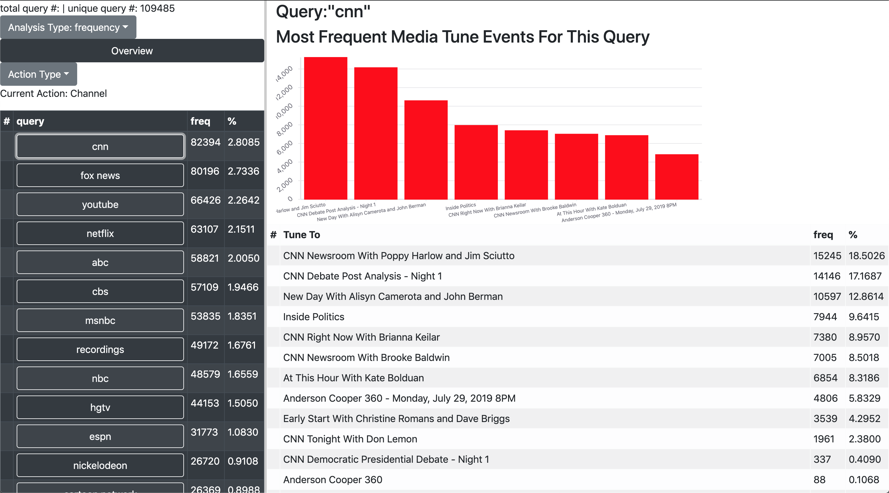
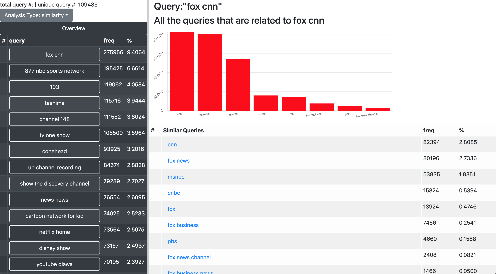
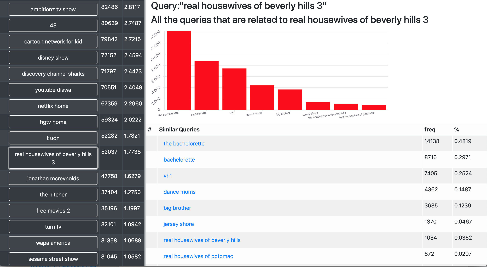

# minimal-flask-react

Based on https://github.com/rwieruch/minimal-react-webpack-babel-setup

## Run Locally

1. npm install
2. npm run dev
3. pip install -r requirements.txt
4. python server.py
5. Goto http://localhost:5000

If you would like to have webpack rebuild your javascript any time your React code changes, enter `npm run start` in a different terminal.

also make sure you have a `embed/` folder which contains pretrained word embeddings. And don't forget to put your data inside `data/`

## Examples
frenquency based clustering for CNN

Universal Sentence Encoder based clustering for CNN

An example of the insights brought by Universal Sentence Encoder

